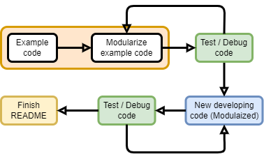

# Arduino Code development

## 1 Development Steps

## 2 Files for one particular hardware

There should have at least three files in the folder for particular hardware: 

- `Modularized example code` : 
  - This is the example code that you copy from somewhere online, this code is the basic example code of testing your piece of hardware is working properly. 
  - Even this is the example code, you still need to verify it with your hardware. 
  - Modularize this code for the future reference
- `Modularized developing code` :
  - This is the code that you need to develop on your own based on the requirements
  - This code must be modularized before you merge to the `develop` branch. This is because someone else who is in charge of the `develop` branch can use your function easily. 
-  `Hardware README` :
  - This README file must be completed before you merge to `develop` branch
  - README file should contain: 
    - Link that you found for this hardware (tutorials/data sheet)
    - Hardware: connection figure and so on.
    - Software: package requirements and configurations

