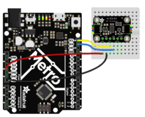

# README first

FYI check the link: https://learn.adafruit.com/adafruit-vl53l0x-micro-lidar-distance-sensor-breakout/arduino-code

## 1 Hardware

- Wiring

  

## 2 Software

`Arduino IDE` -> `Tools` -> `Library Manager` -> Search and install `Adafruit_VL53L0X`

