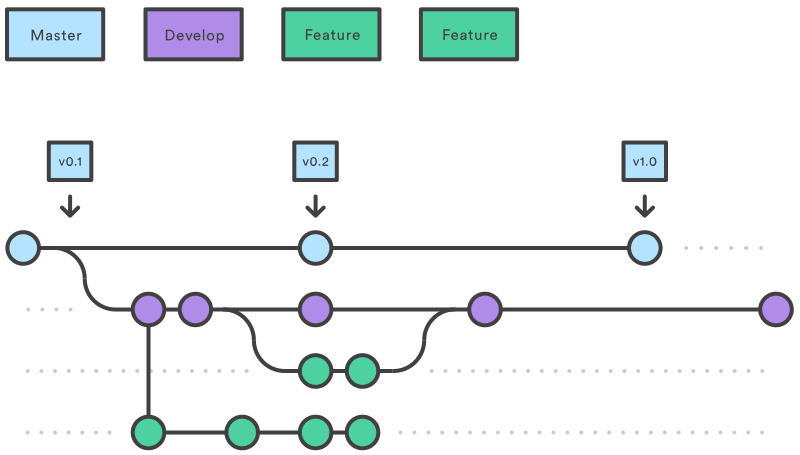
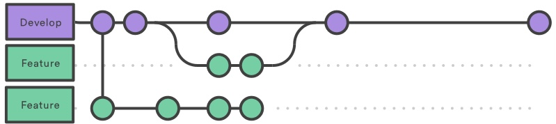

# software_development

This is the master branch and it's only for the final release:



## The main branches

The central repo holds two main branches with an infinite lifetime:

- `master`
- `develop`

The `master` branch at `origin` should be familiar to every Git user. Parallel to the `master` branch, another branch exists called `develop`.

We consider `origin/master` to be the main branch where the source code of `HEAD` always reflects a *production-ready* state.

We consider `origin/develop` to be the main branch where the source code of `HEAD` always reflects a state with the latest delivered development changes for the next release. Some would call this the “integration branch”. This is where any automatic nightly builds are built from.

When the source code in the `develop` branch reaches a stable point and is ready to be released, all of the changes should be merged back into `master` somehow and then tagged with a release number. How this is done in detail will be discussed further on.

Therefore, each time when changes are merged back into `master`, this is a new production release *by definition*. 

## Supporting branches

Next to the main branches `master` and `develop`, our development model uses a variety of supporting branches to aid parallel development between team members, ease tracking of features, prepare for production releases and to assist in quickly fixing live production problems. Unlike the main branches, these branches always have a limited life time, since they will be removed eventually.

The different types of branches we may use are:

- Feature branches
- Testing branches
- Debug/Hotfix branches

Each of these branches have a specific purpose and are bound to strict rules as to which branches may be their originating branch and which branches must be their merge targets. We will walk through them in a minute.

By no means are these branches “special” from a technical perspective. The branch types are categorized by how we *use* them. They are of course plain old Git branches.

### Feature branches

- May branch off from:

  `develop`

- Must merge back into:

  `develop`

- Branch naming convention:

  anything except `master`, `develop`, `release-*`, or `hotfix-*`

Feature branches (or sometimes called topic branches) are used to develop new features for the upcoming or a distant future release. When starting development of a feature, the target release in which this feature will be incorporated may well be unknown at that point. The essence of a feature branch is that it exists as long as the feature is in development, but will eventually be merged back into `develop` (to definitely add the new feature to the upcoming release) or discarded (in case of a disappointing experiment).

Feature branches typically exist in developer repos only, not in `origin`.



#### commands for feature brach

- creating a feature brach 

```shell
git checkout -b feature1 develop
```

- Finished features maybe merged into the `develop` branch

```shell
# switch back to branch 'develop'
git checkout develop
# merge 'feature' brach to develop
git merge --no--ff feature1
# if you have pushed 'feature' branch to the remote repo, remotely delete this branch
git branch -rd origin/feature1
# delete the local 'feature' branch
git branch -d feature1
# push develop
git push origin develop 
```

### Release branch

When the state of the develop branch is ready to become a real release, some actions need to be carried out. First, the release branch is merged into `master` (since every commit on `master` is a new release *by definition*, remember). Next, that commit on `master` must be tagged for easy future reference to this historical version. Finally, the changes made on the release branch need to be merged back into `develop`, so that future releases also contain these bug fixes.

#### commands for releasing branch

```shell
# switch to branch 'master'
git checkout master
# merge the 'develop' to 'master'
git merge --no--ff develop
# add tag to show release version
git tag v1.0 
```

The release is now done, and tagged for feature reference. 

