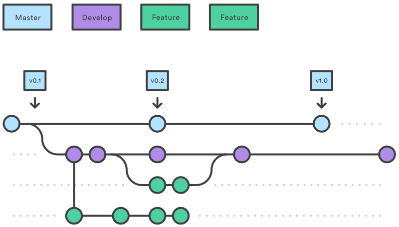

# software_development

This is the master branch and it's only for the final release:

## develop branch

We consider `origin/develop` to be the main branch where the source code of `HEAD` always reflects a state with the latest delivered development changes for the next release. Some would call this the “integration branch”. This is where any automatic nightly builds are built from.

When the source code in the `develop` branch reaches a stable point and is ready to be released, all of the changes should be merged back into `master` somehow and then tagged with a release number. How this is done in detail will be discussed further on.

Therefore, each time when changes are merged back into `master`, this is a new production release *by definition*.