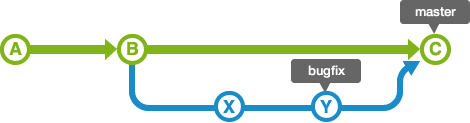
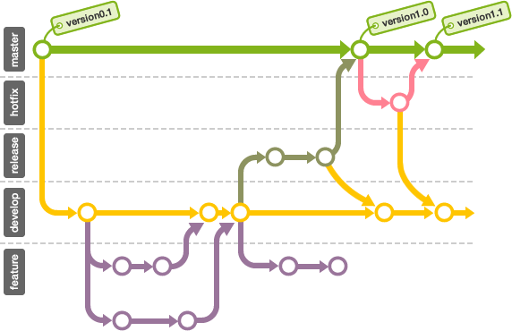

# software_development

This is the master branch and it's only for the final release:


## 1 The main branches

The central repo holds two main branches with an infinite lifetime:

- `master`
- `develop`

The `master` branch at `origin` should be familiar to every Git user. Parallel to the `master` branch, another branch exists called `develop`.

We consider `origin/master` to be the main branch where the source code of `HEAD` always reflects a *production-ready* state.

We consider `origin/develop` to be the main branch where the source code of `HEAD` always reflects a state with the latest delivered development changes for the next release. Some would call this the “integration branch”. This is where any automatic nightly builds are built from.

When the source code in the `develop` branch reaches a stable point and is ready to be released, all of the changes should be merged back into `master` somehow and then tagged with a release number. How this is done in detail will be discussed further on.

Therefore, each time when changes are merged back into `master`, this is a new production release *by definition*. 

## 2 Supporting branches

Next to the main branches `master` and `develop`, our development model uses a variety of supporting branches to aid parallel development between team members, ease tracking of features, prepare for production releases and to assist in quickly fixing live production problems. Unlike the main branches, these branches always have a limited life time, since they will be removed eventually.

The different types of branches we may use are:

- Feature branches
- Testing branches
- Debug/Hotfix branches

Each of these branches have a specific purpose and are bound to strict rules as to which branches may be their originating branch and which branches must be their merge targets. We will walk through them in a minute.

By no means are these branches “special” from a technical perspective. The branch types are categorized by how we *use* them. They are of course plain old Git branches.

### 2.1 Feature branches

- May branch off from:

  `develop`

- Must merge back into:

  `develop`

- Branch naming convention:

  anything except `master`, `develop`, `release-*`, or `hotfix-*`

Feature branches (or sometimes called topic branches) are used to develop new features for the upcoming or a distant future release. When starting development of a feature, the target release in which this feature will be incorporated may well be unknown at that point. The essence of a feature branch is that it exists as long as the feature is in development, but will eventually be merged back into `develop` (to definitely add the new feature to the upcoming release) or discarded (in case of a disappointing experiment).

Feature branches typically exist in developer repos only, not in `origin`.


#### commands for feature brach

- creating a feature brach 

```shell
git checkout -b feature1 develop
```

- Finished features maybe merged into the `develop` branch

```shell
# switch back to branch 'develop'
git checkout develop
# merge 'feature' brach to develop
git merge --no--ff feature1
# if you have pushed 'feature' branch to the remote repo, remotely delete this branch
git branch -rd origin/feature1
# delete the local 'feature' branch
git branch -d feature1
# push develop
git push origin develop 
```

### 2.2 Release branch

When the state of the develop branch is ready to become a real release, some actions need to be carried out. First, the release branch is merged into `master` (since every commit on `master` is a new release *by definition*, remember). Next, that commit on `master` must be tagged for easy future reference to this historical version. Finally, the changes made on the release branch need to be merged back into `develop`, so that future releases also contain these bug fixes.

#### commands for releasing branch

```shell
# switch to branch 'master'
git checkout master
# merge the 'develop' to 'master'
git merge --no--ff develop
# add tag to show release version
git tag v1.0 
```

The release is now done, and tagged for feature reference. 

## 3 Merge and rebase 

After finishing the supporting branches, we need to merge them back to our main branches. There are two ways: 

- Merge 
- Rebase

Use these two methods, the final history record will have a huge difference after two branches are combined.

### 3.1 Merge

Use **merge** can combine multiple history process.

As shown in the figure below, the `bugfix` branch is forked from the `master` branch.


When merging a `bugfix` branch to `master`, if the state of the `master` branch has not changed, then the merge is very simple. The history of the `bugfix` branch contains all the history of the `master` branch, so by moving the position of the `master` branch to the latest branch of the `bugfix`, Git will merge. Such a merge is called a **fast-forward merge**.


However, the history of the `master` branch may have new updates after the `bugfix` branch was forked. In this case, we need to merge the changes in the `master` branch with the changes in the `bugfix` branch.


Therefore, merging two modifications produces one commit. At this point, the HEAD of the `master` branch will be moved to this commit.


#### Note

When performing a merge, if the non fast-forward option is set, a new commit will be generated and merged even if fast-forward merge is possible:

```shell
git merge --no--ff example_merge_branch
```



After executing non fast-forward (`--no--ff`), the branch will remain the same. Then it's easy to find out what's going on in this branch.

### 3.2 Rebase

Like the merge example, the `bugfix` branch is forked from the `master` branch, as shown in the figure below.


If you use the **rebase** method to merge branches, the history shown in the figure below will appear. Now let's briefly explain the **rebase** process.


First, rebase the `bugfix` branch to the `master` branch, and the history of the `bugfix` branch will be added after the `master` branch. As shown, the history is recorded as a line, which is fairly neat.

At this time, moving commits X and Y may conflict, so it is necessary to modify the conflicting parts of their respective commits.


After rebase, the HEAD position of the `master` remains unchanged. Therefore, to merge the `master` branch and the `bugfix` branch, that is, move the HEAD of the master to the HEAD of the `bugfix`.

#### Note

Both **Merge** and **rebase** are merge histories, but each has different characteristics.

- **Merge** 

  Keep a history of what was modified, but history can be complicated

- **Rebase**

  The history record is simple, reflecting the difference content on the basis of the original submission.
  As a result, the original submission may not function properly.

### 3.3 Example

For example, during the development of your supporting branches, you need to fix bugs:


At this time, the main branch is still in the state before the development feature. By creating a new supporting branch that is used to correct errors, it can be separated from the work of developing functions so that new work can be started.


After completing the work of bug fixing, import the branch into the original main branch and then make it public.


Go back to the original branch to continue developing the function.


However, if you want to go ahead, you'll find that you need to fix the content of the previous commit X when the bug was fixed. There are 2 ways to import the contents of commit X: one is to merge directly, and the other is to import the merged branch of commit X with rebase.

Here we use the rebase method of merging branches.


Continue to develop features with the contents of commit X imported.

## A successful Git branching model



## Reference

[1] [Git book](https://git-scm.com/book/en/v2)

[2] [A successful Git branching model](https://nvie.com/posts/a-successful-git-branching-model/)

[3] [猴子都能懂的Git入门](https://backlog.com/git-tutorial/cn/reference/)
