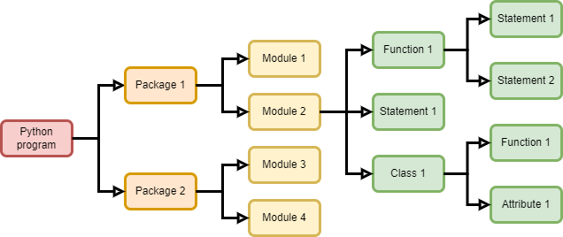

# Python Code Development 

## 1 Modular programming

### 1.1 The evolution of modules and packages 

- At the beginning, the program only implements some single-threaded functions

- **Functions** were born with more and more statements
  Encapsulate multiple statements that implement the same function into functions for unified management and invocation

- With more functions and variables, **classes and objects** were born
  Put the data and behavior of objects of the same type, that is, variables and functions, together for unified management and invocation

- As there were more classes, **modules** were born
  Put functions and classes that implement similar functions into one module

- As there were more modules, **packages** were born
  Group modules that implement similar functionality together



### 1.2 Why modules? 

Modular programming decomposes a task into multiple modules, each module is like a building block, which is convenient for repeated use and construction in the later stage.

Advantages of modular programming:

- It is convenient to decompose a task into multiple modules, realize collaborative development of teams, and complete large-scale programs
- Implement code reuse. After a module is implemented, it can be called repeatedly
- Enhanced maintainability

### 1.3 Modules type

- Modules are divided into **standard modules** and **user-defined modules**
- The Python standard library provides basic functions such as operating system functions, network communication, text processing, file processing, and data operations
- Python provides a large number of third-party modules, similar to the standard library, for artificial intelligence, big data, image recognition, etc.

### 1.4 Modular programming process

- Design API and describe its functions. Often happens in the desire analysis stage
- Realize the function described in API
- Write test code in the module and eliminate global code
- Use private functions (ex: `__init__`) to implement module functions that are not called by external clients

## 2 Standardized programming

### 2.1 Standardized module description

In order to make our module code more readable, we need to have a description at the very beginning of our module, which contains:

- A brief title of this module
- What is this module for
- Authors of this module and the contact info (email)

Example: 

```python
"""
PID control for autonomou UAV

This module contains the PID control class for the navigation of the DJI drone 

author: Zhaoliang Zheng(zhh03@g.ucla.edu)
"""
```

### 2.2 Standardized function description

Functions are very important in the module and properly defining their API and function description is necessary for developers or other users. 

The function description should contain:

- What the function does

- Parameters
- Returns
- Notes (optional)
- Examples (optional)

A show case: 

```python
def example_function(a,b):
    """
    Return a example word: Hello, this is example
    
    Parameters
    ----------
    a: int
    	a random integer
    b: string 
    	a random string
    
    Returns
    -------
    Out: print out an example sentence 
    """
```

Example code from NUMPY library: 

```python
def zeros(shape, dtype=None, order='C'):
    """
    Return a matrix of given shape and type, filled with zeros.
    
    Parameters
    ----------
    shape : int or sequence of ints
        Shape of the matrix
    dtype : data-type, optional
        The desired data-type for the matrix, default is float.
    order : {'C', 'F'}, optional
        Whether to store the result in C- or Fortran-contiguous order,
        default is 'C'.
        
    Returns
    -------
    out : matrix
        Zero matrix of given shape, dtype, and order.
        
    See Also
    --------
    numpy.zeros : Equivalent array function.
    matlib.ones : Return a matrix of ones.
    
    Notes
    -----
    If `shape` has length one i.e. ``(N,)``, or is a scalar ``N``,
    `out` becomes a single row matrix of shape ``(1,N)``.
    
    Examples
    --------
    >>> import numpy.matlib
    >>> np.matlib.zeros((2, 3))
    matrix([[0.,  0.,  0.],
            [0.,  0.,  0.]])
    >>> np.matlib.zeros(2)
    matrix([[0.,  0.]])
    """
    a = ndarray.__new__(matrix, shape, dtype, order=order)
    a.fill(0)
    return a

```

### 2.3 Standardized variables

In order for other developers to understand your code easily, we use [Camel case](https://en.wikipedia.org/wiki/Camel_case) or [Snake case](https://en.wikipedia.org/wiki/Snake_case) in the standardized variables naming. 

```python
"""
In order to standardize the variable name,
we use Camel case naming method, for example: "thisIsCamelCase"
or Snake case: this_is_snake_case
"""
# here are some examples:
verticalHeight = 10
vertical_height = 20
```